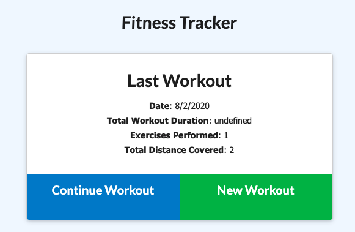
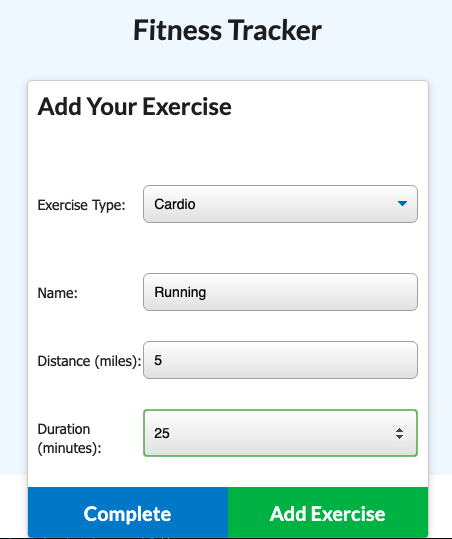
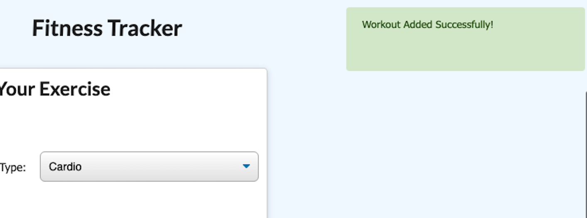
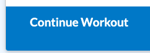
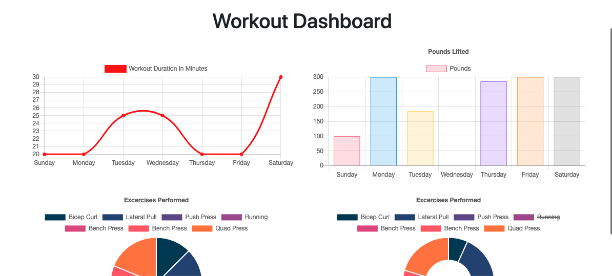

# Fitness Tracker
Studies show that people who track their progress end up seeing better results with physical activity. This app allows you to log and track workouts with individual exersizes. The reults are are tracked and displayed visually in charts on the dashboard for the user to see their progress live.

    # Functionality
✓ Application uses MongoDB for its database.

✓ Application uses mongoose to create its schemas.

✓ Application uses express to handle routes.

✓ Application allows user to see the last workout routine.

✓ Application allows users to create new workout routines.

✓ Application allows users to add exercises to a previous workout routine.

✓ Application allows users to see workout stats (charts).

##Fitness Tracker uses the following list of example commands:
    * npm install 
        - This installs all required packages from the package.json
    * run schema.sql and seed.sql
        - Before running 'node server.js', create the database through the provided schema.sql and seed.sql files
    * npm run seed
        -This inserts the seeds into the database
    * npm start
        - Running this command opens the server and allows the site to begin operating

# Technologies used:
    * Node.js
    * Mongo DB
    * Mongoose
    * Express
    * Express Handlebars

# HTML Routes

## htmlRoutes.js creates routes to each url page
 - index.html ( "/" )
 - exercise.html ( "/exercise" )
- stats.html ( "/stats" )

# API Routes
## apiRoutes.js creates the backend to recieve and send back requests from front end
 - GET ( "/api/workouts" ) - Get all workouts
 - GET ( "/api/workouts/range" ) - Get the first 7 Workouts from the Workout table to be used in the "stats" page.
 - POST ( "/api/workouts" ) - Create a new Workout
- PUT ( "/api/workouts/:id" ) - Update a Workout

# Access the app here: 
Deployed: https://guarded-citadel-93457.herokuapp.com/?id=5f289f09fee497107569dc51

Github: https://github.com/karleighponnock/-Fitness-Tracker

# Author
Karleigh Ponnock
Github: https://github.com/karleighponnock
LinkedIn: https://www.linkedin.com/in/karleigh-ponnock-3601421aa/

